# Sitemap [DEV] — portal-uks.demo.or.id (Portal UKS/M)

## How this was traced

`portal-uks.demo.or.id` is a **Laravel + Inertia.js + React** single‑page app (Vite/rolldown build, code‑split per page). Instead of clicking through blindly, the navigation and homepage structure below were read directly from two pieces of embedded page‑state JSON served in the initial HTML:

- **`<script data-page="app" type="application/json">`** — the Inertia page payload for `Home/V2/Index`, which includes a full `navItems` prop (the exact tree the header renders) plus every data prop that feeds each homepage section (`sliderData`, `programCards`, `latestBerita`, `infografis`, `bukuPanduan`, `latestVideo`, `clients`, `stats`, …).
- **`const Ziggy = {...}`** — Laravel's Ziggy route table, listing all 185 named backend routes (URI + HTTP methods), which cross‑checks every URL found in the nav JSON and in the rendered DOM.

Every internal URL below was also verified live: fetched over HTTP (200 vs. error) and, for the ones that matter, opened in‑browser with console‑error and visual inspection. External links referenced from the homepage were opened directly to confirm they resolve.

Admin/CMS routes (`filament.*`, the `/area-redaksi` back office, auth/profile/settings routes) exist in the Ziggy table but are out of scope — this map covers only the public‑facing site reachable from the header nav and the homepage.

**Update after a second pass:** every header dropdown (desktop, hover‑triggered via Tailwind `group-hover`, including the nested Tautan flyouts) and the mobile hamburger menu were force‑rendered and screenshotted to visually cross‑check against the `navItems` JSON — they match exactly, item for item, on both desktop and mobile. The hero slider was also re‑checked slide‑by‑slide: it actually has **5 slides, not 4** — the `sliderData` prop's last entry is a `type: "berita"` slide, distinct from the other four `type: "slider"` promotional banners, and it renders with a working **"Pelajari Selengkapnya"** button. That correction is reflected in the legend and diagram 2 below.

## Legend

| Symbol | Meaning |
|---|---|
| ✅ | Real internal page — loads, HTTP 200, content renders |
| 🔗 | External link (leaves the site) |
| ❌ | Broken — link target returns an error / not‑found |
| 💥 | Internal route that 500s at the front‑end (server returns 200, but the React page component is missing → blank white page + JS exception) |
| ▾ | Menu‑label‑only — a dropdown header with no destination of its own (`url: null` in the nav data) |
| 🪟 | Opens an in‑page modal/viewer, not a real navigable route |
| ⚠️ | Static content — not a link at all (e.g. hero slides 1–4) |

## Notable issues

1. **💥 `/kontak` (the "Kontak" header button, present on every page) is broken.** The server returns HTTP 200, but the React SPA throws `Uncaught (in promise) Error: Halaman tidak ditemukan: ./pages/Kontak/Index.tsx` and renders a blank page — the `Kontak/Index` page component referenced by the backend simply isn't in the shipped build. This is the single most visible bug on the site, since the Kontak button sits in the header on literally every page.
2. **❌ The homepage "Program Prioritas" section links to broken *external* URLs.** Its four cards (*7 Kebiasaan Anak Indonesia Hebat*, *ASRI*, *Makan Bergizi Gratis*, *Cek Kesehatan Gratis*) point to `https://www.kemendikdasmen.go.id/{7kaih,asri,mbg,ckg}` — all four resolve to that domain's **"Page Not Found"** page. Confusingly, the header's **Program** dropdown links to fully working *internal* pages for the exact same four topics (`/7kaih`, `/mbg`, `/ckg`, `/asri`) — so the same content is one click away and broken, or one menu away and fine, depending only on where the visitor starts.
3. **Malformed footer link.** The footer's "official website" link has a leading space baked into the `href` (`" https://uks.kemendikdasmen.go.id"`). Browsers tolerate it, so it isn't functionally broken, but it's a code smell — and it points at the separate production instance of this same portal, not this demo domain.
4. **Cross‑domain partner logos.** Several "Mitra UKS" partner logos in `clients[].logo_url` are hard‑coded to `https://uks.kemendikdasmen.go.id/storage/...` (the production asset host) instead of this demo domain, unlike the rest of the site's images. Inconsistent, and fragile if that host's access policy ever changes.
5. **Mismatched app listing.** The "SATUSEHAT" card in the homepage Aplikasi section links to the Play Store package `com.telkom.tracencare` — the legacy **PeduliLindungi/TraceCare** app, not an official SATUSEHAT Mobile package. Looks like stale/placeholder demo data.
6. **Breadcrumb typo.** The `/mitra-uks` page's breadcrumb reads "**UK/M**" instead of "**UKS/M**".
7. **Inconsistent hero slider behaviour.** The homepage hero rotates through 5 slides, but only the last one (a news item, "Rapat Koordinasi...") is clickable, via a "Pelajari Selengkapnya" button that fades in only on that slide. The other 4 (7KAIH, ASRI, CKG, MBG promotional banners) have no `link_url` and no CTA at all — they look identical in format to slide 5 but do nothing when clicked. A visitor has no way to tell, by looking, which slide is interactive.
8. **Orphaned legacy routes.** The Ziggy table carries a full parallel set of `*-v1` routes (`/halaman/berita-v1`, `/informasi/agenda-v1`, `/dokumen/publikasi/buku-panduan-v1`, `/aktifitas-mitra-v1`, `/pencarian-v1`, `/informasi/praktik-baik-v1`, `/informasi/upt-bercerita-v1`, `/informasi/aplikasi-v1`, `/dokumen/produk-hukum-v1`, `/tentang-uks-v2/{slug}`) that aren't linked from the header nav or the homepage anywhere. They appear to be superseded "V2" redesign leftovers, kept alive server‑side but orphaned from the UI.

Everything else checked — all header‑nav destinations and all homepage‑linked internal pages — loaded cleanly with real content (no empty states, no console errors beyond the `/kontak` case above).

---

## 1. Header navigation tree

```mermaid
flowchart TD
    header(["Header (on every page)"])

    header --> beranda["✅ Beranda<br/>/"]
    header --> uksm["▾ UKS/M"]
    header --> program["▾ Program"]
    header --> mitra["▾ Mitra"]
    header --> informasi["▾ Informasi"]
    header --> publikasi["▾ Publikasi"]
    header --> tautan["▾ Tautan"]
    header --> search["✅ 🔍 search icon<br/>/pencarian"]
    header --> kontak["💥 Kontak button<br/>/kontak<br/>(blank page — component missing)"]

    uksm --> tentangUksm["✅ Tentang UKS/M<br/>/tentang-uks"]
    uksm --> triasUksm["✅ Trias UKS/M<br/>/trias-uks"]
    uksm --> manajemenUksm["✅ Manajemen UKS/M<br/>/manajemen-uks"]
    uksm --> stratifikasi["✅ Stratifikasi UKS/M<br/>/stratifikasi-uks"]

    program --> p7kaih["✅ 7KAIH<br/>/7kaih"]
    program --> pmbg["✅ MBG<br/>/mbg"]
    program --> pckg["✅ CKG<br/>/ckg"]
    program --> pasri["✅ ASRI<br/>/asri"]

    mitra --> mitraUksmPage["✅ Tentang Mitra UKS/M<br/>/mitra-uks"]
    mitra --> panduanKemitraan["✅ Panduan Kemitraan<br/>/mitra/panduan-kemitraan"]
    mitra --> mitraKami["✅ Mitra Kami<br/>/mitra/mitra-kami"]
    mitra --> aktivitasMitra["✅ Aktivitas Mitra<br/>/aktifitas-mitra"]
    mitra --> dukunganMitra["✅ Dukungan Mitra<br/>/mitra/dukungan-mitra"]

    informasi --> berita["✅ Berita<br/>/halaman/berita"]
    informasi --> praktikBaik["✅ Praktik Baik<br/>/informasi/praktik-baik"]
    informasi --> uptBercerita["✅ UPT Bercerita<br/>/informasi/upt-bercerita"]
    informasi --> agenda["✅ Agenda<br/>/informasi/agenda"]
    informasi --> aplikasi["✅ Aplikasi<br/>/informasi/aplikasi"]

    publikasi --> produkHukum["✅ Produk Hukum<br/>/dokumen/produk-hukum"]
    publikasi --> bukuPanduan["✅ Buku Panduan<br/>/dokumen/publikasi/buku-panduan"]
    publikasi --> infografis["✅ Infografis<br/>/dokumen/publikasi/infografis"]
    publikasi --> video["✅ Video<br/>/dokumen/publikasi/video"]

    tautan --> kemenkesGrp["▾ Kemenkes"]
    tautan --> kdmGrp["▾ Kemendikdasmen"]
    tautan --> kemenagGrp["▾ Kemenag"]
    tautan --> kemendagriGrp["▾ Kemendagri"]

    kemenkesGrp --> kk1["🔗 Kementerian Kesehatan<br/>kemkes.go.id"]
    kemenkesGrp --> kk2["🔗 Ayo Sehat Kemenkes<br/>ayosehat.kemkes.go.id"]
    kemenkesGrp --> kk3["🔗 Perangkat Ajar Kesehatan<br/>ayosehat.kemkes.go.id/perangkat-ajar-kesehatan"]

    kdmGrp --> kdm1["🔗 Ditjen PAUDDIKDASMEN<br/>pdm.kemendikdasmen.go.id"]
    kdmGrp --> kdm2["🔗 Direktorat PAUD<br/>paudpedia.kemendikdasmen.go.id"]
    kdmGrp --> kdm3["🔗 Direktorat SD<br/>ditsd.kemendikdasmen.go.id"]
    kdmGrp --> kdm4["🔗 Direktorat SMP<br/>ditsmp.kemendikdasmen.go.id"]
    kdmGrp --> kdm5["🔗 Direktorat SMA<br/>sma.kemendikdasmen.go.id"]

    kemenagGrp --> ka1["🔗 Direktorat KSKK<br/>pendis.kemenag.go.id/ditkskkmadrasah"]
    kemenagGrp --> ka2["🔗 Direktorat Pesantren<br/>pendis.kemenag.go.id/ditpdpontren"]

    kemendagriGrp --> kdg1["🔗 Direktorat SUPD<br/>bangda.kemendagri.go.id"]

    classDef broken fill:#ffe0e0,stroke:#c0392b,stroke-width:2px,color:#7b241c;
    classDef ext fill:#eef3ff,stroke:#5470c4,color:#26418f;
    classDef label fill:#f4f4f4,stroke:#999,color:#555;

    class kontak broken;
    class kk1,kk2,kk3,kdm1,kdm2,kdm3,kdm4,kdm5,ka1,ka2,kdg1 ext;
    class uksm,program,mitra,informasi,publikasi,tautan,kemenkesGrp,kdmGrp,kemenagGrp,kemendagriGrp label;
```



---

## 2. Homepage sections → destinations

Node IDs match diagram 1 where the destination is the *same page* (`stratifikasi`, `berita`, `bukuPanduan`, `infografis`, `video`), to make the convergence between "reachable from the header nav" and "reachable from a homepage section" visible.

```mermaid
flowchart TD
    home(["Homepage /"])

    home --> hdr["Header row"]
    hdr --> search2["✅ 🔍 search icon → /pencarian"]
    hdr --> kontak["💥 Kontak button → /kontak (blank page)"]

    home --> hero["Hero slider (5 slides)"]
    hero --> heroPromo["Slides 1–4: 7KAIH / ASRI /<br/>CKG / MBG banners"]
    heroPromo -. "link_url is null" .-> heroNote["⚠️ not clickable, banner only"]
    hero --> heroNews["Slide 5: \"Rapat Koordinasi...\"<br/>(type: berita)"]
    heroNews -- "\"Pelajari Selengkapnya\"" --> beritaDetail

    home --> trias["Trias UKS section<br/>(3 cards)"]
    trias --> progPendidikan["✅ Pendidikan Kesehatan<br/>/program/pendidikan-kesehatan"]
    trias --> progPelayanan["✅ Pelayanan Kesehatan<br/>/program/pelayanan-kesehatan"]
    trias --> progLingkungan["✅ Pembinaan Lingkungan<br/>/program/pembinaan-lingkungan-sekolah-sehat"]

    home --> stratSection["Stratifikasi UKS/M section<br/>(4 strata boxes + \"Lihat Detail\")"]
    stratSection --> stratifikasi["✅ /stratifikasi-uks<br/>(same page as nav ▸ UKS/M ▸ Stratifikasi UKS/M)"]

    home --> beritaSection["Berita section<br/>(4 article cards)"]
    beritaSection --> beritaDetail["✅ 4× article detail pages<br/>/halaman/berita/{slug}<br/>(1 of these is the same \"Rapat Koordinasi...\" article as hero slide 5)"]
    beritaSection --> berita["✅ \"Lihat Berita Lainnya\" → /halaman/berita<br/>(same page as nav ▸ Informasi ▸ Berita)"]

    home --> progPrioritas["Program Prioritas section<br/>(4 cards, same topics as nav ▸ Program)"]
    progPrioritas --> extBroken["❌ kemendikdasmen.go.id/7kaih<br/>❌ /asri  ❌ /mbg  ❌ /ckg<br/>(all → \"Page Not Found\")"]

    home --> modulSection["Modul Terbaru section<br/>(4 PDF cards)"]
    modulSection --> modulViewer["🪟 opens in‑page PDF viewer modal<br/>(no route)"]
    modulSection --> bukuPanduan["✅ \"Temukan Modul Lainnya\" → /dokumen/publikasi/buku-panduan<br/>(same page as nav ▸ Publikasi ▸ Buku Panduan)"]

    home --> infografisSection["Infografis section<br/>(4 poster cards)"]
    infografisSection --> infografisViewer["🪟 opens in‑page image viewer modal<br/>(no route)"]
    infografisSection --> infografis["✅ \"Lihat Infografis Lainnya\" → /dokumen/publikasi/infografis<br/>(same page as nav ▸ Publikasi ▸ Infografis)"]

    home --> videoSection["Video section<br/>(4 video cards)"]
    videoSection --> ytLinks["🔗 4× YouTube video pages"]
    videoSection --> video["✅ \"Temukan Video Lainnya\" → /dokumen/publikasi/video<br/>(same page as nav ▸ Publikasi ▸ Video)"]

    home --> tautanSection["Tautan Terkait section<br/>(4 logos)"]
    tautanSection --> govLinks["🔗 kemendagri.go.id, kemenag.go.id,<br/>kemkes.go.id, kemendikdasmen.go.id"]

    home --> aplikasiSection["Aplikasi section"]
    aplikasiSection --> oky["🔗 OKY → Play Store (com.oky.id)"]
    aplikasiSection --> satusehat["🔗 SATUSEHAT → Play Store<br/>⚠️ pkg is com.telkom.tracencare (TraceCare/PeduliLindungi, not SATUSEHAT)"]

    home --> mitraSection["Mitra UKS section<br/>(~20 partner logos)"]
    mitraSection --> clientLinks["🔗 partner websites<br/>(several have no URL set)"]

    home --> footer["Footer"]
    footer --> footerWebsite["🔗 uks.kemendikdasmen.go.id<br/>⚠️ malformed href (leading space)"]
    footer --> footerEmail["🔗 mailto:uks.dikdasmen@kemdikbud.go.id"]

    classDef broken fill:#ffe0e0,stroke:#c0392b,stroke-width:2px,color:#7b241c;
    classDef ext fill:#eef3ff,stroke:#5470c4,color:#26418f;
    classDef modal fill:#fff6da,stroke:#b8860b,color:#7a5c00;
    classDef warn fill:#fff6da,stroke:#b8860b,color:#7a5c00;

    class kontak,extBroken broken;
    class search2,ytLinks,govLinks,oky,satusehat,clientLinks,footerWebsite,footerEmail ext;
    class modulViewer,infografisViewer modal;
    class heroNote,satusehat,footerWebsite warn;
```

---

## 3. What each page shows

Content was read from each page's live text (`get_page_text`) after navigating there for real, not just from route names — so this reflects what actually renders, not just the label.

### Homepage

| Page | What's on it |
|---|---|
| `/` — **Beranda** | Header (logo, search icon, 💥 Kontak) → hero slider (5 slides, only slide 5 clickable) → **Trias UKS** 3‑pillar cards → **Stratifikasi UKS/M** 4‑strata explainer → latest **Berita** (4 cards) → **Program Prioritas** (4 cards, ❌ broken external links) → **Modul Terbaru** (4 latest Buku Panduan PDFs, open in a viewer modal) → **Infografis** (4 latest posters, modal) → **Video** (4 latest, link out to YouTube) → **Tautan Terkait** (4 ministry logos) → **Aplikasi** (OKY + mismatched "SATUSEHAT") → **Mitra UKS** (~20 partner logos) → footer (contact address/email/phone, malformed website link) |

### UKS/M

| Page | What's on it |
|---|---|
| `/tentang-uks` | UKS/M definition and mission; the 3 Trias UKS/M pillars explained; **Tujuan UKS/M** (goals); **Struktur Organisasi** (Tim Pembina UKS/M vs. Tim Pelaksana UKS/M); **Sasaran** (Murid, Pendidik, Tenaga Kependidikan, Masyarakat Sekolah); 3 embedded Video Edukasi; 4 latest Praktik Baik stories |
| `/trias-uks` | Deep dive on the same 3 pillars (Pendidikan Kesehatan, Pelayanan Kesehatan, Pembinaan Lingkungan Sekolah Sehat), each expanded into numbered sub‑programs (7, 5, and 5 respectively — e.g. Literasi Kesehatan, PHBS, Pendidikan Gizi, Dokter Kecil…) with schedule/venue/implementer detail cards and step‑by‑step "Langkah‑langkah" lists |
| `/manajemen-uks` | How UKS/M is administered: **Kebijakan** (policy basis), **Perencanaan & Penganggaran**, **Kegiatan Prioritas**, **SDM & Sasaran**, **Sumber Anggaran** (APBN/APBD), **Koordinasi** across government levels (Pusat → Provinsi → Kab/Kota → Kecamatan → Satuan Pendidikan), **Peningkatan Kapasitas** (teacher training) |
| `/stratifikasi-uks` | Explains the Stratifikasi UKS/M scoring system: what it is, its purpose (**Tujuan Stratifikasi**), and how it measures the Trias UKS (**Alat Ukur**) across the 4 strata (Minimal → Standar → Optimal → Paripurna) |

### Program

| Page | What's on it |
|---|---|
| `/7kaih` | Full explainer of Gerakan 7 Kebiasaan Anak Indonesia Hebat — the 7 habits (Bangun Pagi, Beribadah, Berolahraga, Makan Sehat dan Bergizi, Gemar Belajar, Bermasyarakat, Tidur Cepat), each with its own card and "Pelajari Lebih Lanjut"; a "Mulai Sekarang" CTA; 4 downloadable Panduan PDFs (one per education level); 4 Infografis posters; 3 Video Edukasi; 4 Praktik Baik stories |
| `/mbg` | Makan Bergizi Gratis program page: legal basis (Perpres No. 83/2024), coordinating body (Badan Gizi Nasional / SPPG), program description |
| `/ckg` | Cek Kesehatan Gratis Sekolah program page: free annual health screening for grades 1–12 (and pesantren), what's checked and why |
| `/asri` | Gerakan Sekolah ASRI program page: the "Aman, Sehat, Resik, Indah" campaign for school environments |

### Mitra

| Page | What's on it |
|---|---|
| `/mitra-uks` | "Tentang Mitra UKS/M" — bidang usaha mitra (industry sectors that can partner), bentuk dukungan mitra (support types), partnership overview |
| `/mitra/panduan-kemitraan` | Partnership guide: **Bentuk Kerja Sama** — sarana/prasarana, capacity‑building, publikasi/komunikasi support, etc. |
| `/mitra/mitra-kami` | Full partner directory grouped by year — **Mitra 2025** (~20 named orgs: UNICEF, Save the Children, AIA, KAO, Danone, BGN, BPOM, UPI…), **Mitra 2023–2024** (~25 more), **Mitra 2022** (~7 more) |
| `/aktifitas-mitra` | Filterable/sortable feed of partner collaboration news (e.g. "Kemendikbudristek RI, WVI, dan Sun Life Indonesia Kolaborasi…") |
| `/mitra/dukungan-mitra` | Table of concrete partner contributions — Nama Mitra / Periode / Bentuk Dukungan (e.g. UNICEF Nutrition Section, Mar–Nov 2025) |

### Informasi

| Page | What's on it |
|---|---|
| `/halaman/berita` | News list, filterable by category (Pendidikan, UKS, Umum, GSS), sortable by date, with the same 4+ articles seen on the homepage plus more |
| `/informasi/praktik-baik` | "Good practice" stories, filterable by type (Video/Artikel) and category (Praktik Baik 7KAIH, MBG, PAUD, PMP, SD, SMK…) |
| `/informasi/upt-bercerita` | Storytelling feed from regional education units (UPT), filterable by category (7KAIH, CKG, MBG, UKS) — e.g. MBG rollout stories from Tanjungpinang, Pangandaran, Jakarta Selatan |
| `/informasi/agenda` | Event listing — 17 events across 2 pages, filterable/sortable, spanning 2022–2024 (Sekolah Sehat launches, Bimtek webinars, Gala Kreasi competition, HCTPS campaign) |
| `/informasi/aplikasi` | App directory: **SIJIWA** (mental‑health information system, by Garuda Teknologi Indonesia) and **Oky Period Tracker** (UNICEF), each with a description and download link |

### Publikasi

| Page | What's on it |
|---|---|
| `/dokumen/produk-hukum` | Legal/regulatory document library, filterable by type (UU, PP, Perpres, Kepres, Inpres, Peraturan Bersama, Kepmen, Permen, Permenko, SE, SK, MOU) |
| `/dokumen/publikasi/buku-panduan` | Downloadable PDF guide library with search (e.g. Panduan Implementasi MBG, Pedoman Kesehatan Sekolah, Modul Kesehatan Reproduksi Remaja) |
| `/dokumen/publikasi/infografis` | Poster/infographic gallery, paginated (Poster 8 MBG, Poster 7KAIH per education level, Gala Kreasi posters, Komik Strip BIAN…) |
| `/dokumen/publikasi/video` | YouTube video library (MBG explainer, UKS field activities in Karawang/Medan, 7KAIH anthem…) |

### Tautan

All four sub‑groups (Kemenkes, Kemendikdasmen, Kemenag, Kemendagri) are pure external‑link lists — no page content of their own, just a flyout of ministry/directorate homepage URLs (see diagram 1).

### Search / Contact

| Page | What's on it |
|---|---|
| `/pencarian` | Search page: input box, empty state ("Mulai Pencarian — ketik kata kunci…"), and 4 suggested keyword chips (Kesehatan Siswa, UKS Mandiri, Gizi Sekolah, Cuci Tangan) |
| `/kontak` | 💥 **Nothing — blank page.** See Notable issue #1. |

### Homepage‑only destinations (not in any nav menu)

| Page | What's on it |
|---|---|
| `/program/pendidikan-kesehatan` | Long‑form detail page for the Pendidikan Kesehatan pillar (reached only via the homepage Trias UKS card) |
| `/program/pelayanan-kesehatan` | Long‑form detail page for the Pelayanan Kesehatan pillar |
| `/program/pembinaan-lingkungan-sekolah-sehat` | Long‑form detail page for the Pembinaan Lingkungan pillar |
