# Sitemap: Portal UKS/M (source of truth)

**Status:** Source of truth for the site structure, as of 2026-09-17.
**Built from:** this project (`src/`, branch `rama/feat/curation-mockup-site`). Its structure is the redesign's navigation.
**Companion:** [content-inventory.md](./content-inventory.md), which covers what goes on each page, where the content comes from, and what to do with it.

## What this sitemap is, and isn't

- **The structure is final input for the redesign.** Pages, sections, labels and navigation depth are as built in this project.
- **The content is not all real.** UKS/M, Program and Mitra are curated from the prod and dev scrapes. Beranda, Informasi, Publikasi, Kontak and the footer still carry mock content. Each page below says which. Item-level status is in the content inventory.
- **URLs are proposals.** The project has no router: pages switch by state and sections scroll to an `id`. The *Proposed URL* column turns each page key and section id into a path, so the redirect map has a target. The IA owner confirms the final paths.

Replaced sitemaps: [sitemap-prod-uks.MD](./sitemap-prod-uks.MD) (live site) and [sitemap-dev-uks.MD](./sitemap-dev-uks.MD) (V2 demo). They stay as the record of the old structure.

## Content status legend

| Mark | Meaning |
|---|---|
| ✅ | Content curated from a source file in `docs/` |
| 🟡 | Mostly sourced, with open owner items |
| 🔴 | Structure is final, content is mock or has no source |
| 🔗 | External link |

---

## 1. Navigation tree

Two levels in the menu (menu ▸ page), then in-page sections. Prod goes up to four menu levels (UKS/M ▸ Trias ▸ pillar ▸ sub-program).

```mermaid
flowchart TD
    header(["Header (every page)"])

    header --> beranda["✅🔴 Beranda<br/>/"]
    header --> uksm["▾ UKS/M"]
    header --> program["✅ Program<br/>/program"]
    header --> mitra["✅ Mitra<br/>/mitra"]
    header --> informasi["🔴 Informasi<br/>/informasi"]
    header --> publikasi["🔴 Publikasi<br/>/publikasi"]
    header --> tautan["▾ Tautan"]
    header --> kontak["🔴 Kontak<br/>/kontak"]
    header --> search["🔍 Pencarian<br/>/pencarian"]

    uksm --> profil["✅ 1. Profil & Tata Kelola<br/>/uksm/profil"]
    uksm --> trias["✅ 2. TRIAS UKS/M<br/>/uksm/trias"]
    uksm --> strat["🟡 3. Stratifikasi UKS/M<br/>/uksm/stratifikasi"]
    uksm --> gss["✅ 4. Sekolah Sehat (GSS)<br/>/uksm/sekolah-sehat"]

    tautan --> tk["🔗 Kemenkes (3)"]
    tautan --> tkd["🔗 Kemendikdasmen (5)"]
    tautan --> tka["🔗 Kemenag (2)"]
    tautan --> tkdg["🔗 Kemendagri (1)"]

    informasi --> beritaDetail["🔴 Detail berita<br/>/informasi/berita/{slug}"]

    classDef mock fill:#ffe0e0,stroke:#c0392b,color:#7b241c;
    classDef part fill:#fff2cc,stroke:#b8860b,color:#7a5c00;
    classDef ext fill:#eef3ff,stroke:#5470c4,color:#26418f;
    classDef label fill:#f4f4f4,stroke:#999,color:#555;
    class informasi,publikasi,kontak,beritaDetail mock;
    class strat part;
    class tk,tkd,tka,tkdg ext;
    class uksm,tautan label;
```

**Header order:** Beranda · UKS/M ▾ · Program · Mitra · Informasi · Publikasi · Tautan ▾ · Kontak · 🔍

**Footer:** description, secretariat contact (address, email, phone, website), and a "Peta Navigasi" list with the same destinations as the header.

---

## 2. Pages and sections

The page key and section id are the project's real identifiers (`src/data/navigation.js`). Section labels are the ones shown in the page drawer.

### Beranda: `beranda` · `/` · ✅🔴 mixed

| Section id | Label | Proposed URL | Content |
|---|---|---|---|
| `sec-home-hero` | Hero | `/` | 🔴 Slides built from mock news |
| `sec-home-stats` | Metrik Nasional | `/` | 🔴 4 figures, no source |
| `sec-home-trias` | Trias UKS/M | `/#trias` | ✅ 3 pillar cards → Trias page |
| `sec-home-stratifikasi` | Stratifikasi UKS/M | `/#stratifikasi` | 🟡 4 strata → Stratifikasi page (names undecided) |
| `sec-home-gss` | 5 Fokus Sekolah Sehat | `/#sekolah-sehat` | ✅ 5 focus cards → GSS page |
| `sec-home-programs` | Program Unggulan | `/#program` | ✅ 5 programs from Program data |
| `sec-home-news` | Kabar Terbaru | `/#berita` | 🔴 Mock news |
| `sec-home-books` | Buku & Panduan | `/#buku` | 🔴 Mock books |
| `sec-home-gallery` | Galeri | `/#infografis` | 🔴 Mock infografis + partner strip |

Drawer entries with no section on the page: `sec-home-video`, `sec-home-tautan`, `sec-home-aplikasi`, `sec-home-mitra` (see inventory B-16).

### UKS/M ▸ 1. Profil & Tata Kelola: `uksm-profil` · `/uksm/profil` · ✅

| Section id | Label | Proposed URL | Content |
|---|---|---|---|
| `sec-profil-deskripsi` | Deskripsi Umum | `/uksm/profil#deskripsi` | ✅ Definition, 3 Trias pillars, how UKS/M keeps running |
| `sec-profil-tujuan` | Tujuan | `/uksm/profil#tujuan` | 🟡 Tujuan sentence (official wording undecided) |
| `sec-profil-sasaran` | Sasaran | `/uksm/profil#sasaran` | ✅ 4 target groups, 6 stakeholders |
| `sec-profil-struktur` | Struktur Organisasi | `/uksm/profil#struktur` | 🟡 Tabs: Tim Pembina / Tim Pelaksana (chart images pending) |
| `sec-profil-manajemen` | Manajemen UKS/M | `/uksm/profil#manajemen` | ✅ 5 components, monitoring (20 items), evaluation |

### UKS/M ▸ 2. TRIAS UKS/M: `uksm-trias` · `/uksm/trias` · ✅

| Section id | Label | Proposed URL | Content |
|---|---|---|---|
| `sec-trias-pendidikan` | (1) Pendidikan Kesehatan | `/uksm/trias#pendidikan-kesehatan` | ✅ 7 sub-programs (PHBS body pending) |
| `sec-trias-pelayanan` | (2) Pelayanan Kesehatan | `/uksm/trias#pelayanan-kesehatan` | ✅ 4 sub-programs |
| `sec-trias-lingkungan` | (3) Pembinaan Lingkungan Sekolah Sehat | `/uksm/trias#pembinaan-lingkungan` | ✅ 5 sub-programs |

Each sub-program is an accordion item, addressable as `/uksm/trias#{item-id}`:

| Pillar | Item ids |
|---|---|
| Pendidikan | `literasi-kesehatan` · `perilaku-hidup-bersih-dan-sehat` · `pendidikan-gizi` · `pendidikan-kesehatan-reproduksi` · `pendidikan-karakter` · `pembiasaan-aktivitas-fisik` · `dokter-kecil` |
| Pelayanan | `penjaringan-kesehatan-dan-pemeriksaan-berkala` · `imunisasi` · `pemberian-obat-cacing` · `p3k-dan-p3p` |
| Lingkungan | `sanitasi-sekolah` · `pembinaan-kantin-sehat` · `pemanfaatan-pekarangan-sekolah` · `pemberantasan-sarang-nyamuk` · `kawasan-tanpa-rokok-napza-kekerasan-pornografi` |

### UKS/M ▸ 3. Stratifikasi UKS/M: `uksm-stratifikasi` · `/uksm/stratifikasi` · 🟡

| Section id | Label | Proposed URL | Content |
|---|---|---|---|
| `sec-strat-pengertian` | Apa itu Stratifikasi UKS/M? | `/uksm/stratifikasi#pengertian` | ✅ Intro + 🔗 Dasbor Stratifikasi (stratifikasiuks.org) |
| `sec-strat-tujuan` | Tujuan Stratifikasi UKS | `/uksm/stratifikasi#tujuan` | ✅ 4 goals |
| `sec-strat-penilaian` | Cara Penilaian | `/uksm/stratifikasi#penilaian` | ✅ Scoring rule |
| `sec-strat-indikator` | Indikator per Strata | `/uksm/stratifikasi#indikator` | 🟡 SD rubric, 4 categories × 4 strata (strata names undecided) |

### UKS/M ▸ 4. Sekolah Sehat (GSS): `uksm-gss` · `/uksm/sekolah-sehat` · ✅

| Section id | Label | Proposed URL | Content |
|---|---|---|---|
| (hero) | Gerakan Sekolah Sehat | `/uksm/sekolah-sehat` | ✅ Intro + 🔗 Gerakan Madrasah Sehat (Kemenag) |
| `sec-gss-overview` | Konsep Gerakan Sekolah Sehat | `/uksm/sekolah-sehat#konsep` | ✅ Definition, 5 foci, manfaat, sasaran, videos |
| `sec-gss-5sehat` | 5 Fokus Pembiasaan | `/uksm/sekolah-sehat#{fokus}` | ✅ Tabs: `bergizi` · `fisik` · `imunisasi` · `jiwa` · `lingkungan` (activities, topics, tools) |
| `sec-gss-advokasi` | Bahan Advokasi | `/uksm/sekolah-sehat#bahan-advokasi` | ✅ 18 produk hukum + 20 campaign materials, searchable |

### Program: `program` · `/program` · ✅

One page, with a program picker. Each program is a section.

| Section id | Label | Proposed URL | Content |
|---|---|---|---|
| `sec-prog-mbg` | Makan Bergizi Gratis (MBG) | `/program#mbg` | ✅ Lead, facts, sasaran, dampak, rujukan |
| `sec-prog-ckg` | Cek Kesehatan Gratis (CKG) Sekolah | `/program#ckg` | ✅ Facts, paket per jenjang, alur H-7 → setelah, rujukan |
| `sec-prog-7kaih` | Gerakan 7KAIH | `/program#7kaih` | ✅ 7 habits, urgensi, buku panduan |
| `sec-prog-asri` | Gerakan Sekolah ASRI | `/program#asri` | ✅ 4 pillars, Jumat Bersih example |
| `sec-prog-prestasi` | Prestasi | `/program#prestasi` | ✅ Competitions hub: SAIH 2025, Gala Kreasi 2024 and 2023, each with mekanisme / pengumuman / showcase pemenang |

### Mitra: `mitra` · `/mitra` · ✅

| Section id | Label | Proposed URL | Content |
|---|---|---|---|
| `sec-mitra-panduan` | Panduan Kemitraan | `/mitra#panduan` | ✅ 10 forms of cooperation in 4 themes, rules, benefits |
| `sec-mitra-kriteria` | Kriteria & Pendaftaran Mitra | `/mitra#kriteria` | 🟡 3 sectors + requirements; registration status only |
| `sec-mitra-kami` | Mitra Kami | `/mitra#mitra-kami` | ✅ Bidang usaha, bentuk dukungan, partners 2025 / 2023–2024 / 2022 |
| `sec-mitra-dukungan` | Dukungan Mitra | `/mitra#dukungan` | ✅ 2025 support records (6 detailed, 14 without record) |

### Informasi: `informasi` · `/informasi` · 🔴

One page with tabs; each tab is a filterable list.

| Section id | Label | Proposed URL | Content |
|---|---|---|---|
| `sec-info-berita` | Berita | `/informasi/berita` | 🔴 Mock list; detail at `/informasi/berita/{slug}` |
| `sec-info-praktik` | Praktik Baik | `/informasi/praktik-baik` | 🔴 Mock list; no category filter, no detail page |
| `sec-info-upt` | UPT Bercerita | `/informasi/upt-bercerita` | 🔴 Mock list with categories; no detail page |
| `sec-info-agenda` | Agenda | `/informasi/agenda` | 🔴 Mock list |
| `sec-info-aplikasi` | Aplikasi | `/informasi/aplikasi` | 🔴 3 apps; SIJIWA developer conflicts with GSS source |

### Publikasi: `publikasi` · `/publikasi` · 🔴

One page with tabs.

| Section id | Label | Proposed URL | Content |
|---|---|---|---|
| `sec-pub-books` | Buku Panduan | `/publikasi/buku-panduan` | 🔴 Mock list, in-page PDF viewer |
| `sec-pub-infografis` | Infografis | `/publikasi/infografis` | 🔴 Mock list, lightbox |
| `sec-pub-video` | Video | `/publikasi/video` | 🔴 Mock list |
| `sec-pub-regulasi` | Produk Hukum | `/publikasi/produk-hukum` | 🔴 3 unsourced items (a sourced 18-item list is on the GSS page) |

### Kontak: `kontak` · `/kontak` · 🔴

| Section id | Label | Proposed URL | Content |
|---|---|---|---|
| `sec-kontak-alamat` | Alamat Sekretariat | `/kontak#alamat` | 🔴 Address, phone and hours have no source; email ✅ |
| `sec-kontak-helpdesk` | Helpdesk | `/kontak#helpdesk` | 🔴 No source |
| `sec-kontak-tiket` | Formulir Pertanyaan | `/kontak#formulir` | 🔴 Does not submit; shows a fake ticket number |
| `sec-kontak-faq` | FAQ | `/kontak#faq` | 🔴 3 answers with no source; one contradicts the Stratifikasi rubric |

### Pencarian: `search` · `/pencarian`

Searches Trias, strata, GSS foci, programs, books, news, praktik baik, agenda, videos, regulations, apps and UPT stories. Results inherit each list's status, so half the index is mock data.

### Tautan (menu only, no page)

| Group | Links |
|---|---|
| Kemenkes | Kementerian Kesehatan · Ayo Sehat Kemenkes · Perangkat Ajar Kesehatan |
| Kemendikdasmen | Ditjen PAUDDIKDASMEN · Direktorat PAUD · Direktorat SD · Direktorat SMP · Direktorat SMA |
| Kemenag | Direktorat KSKK Madrasah · Direktorat Pesantren |
| Kemendagri | Direktorat SUPD (Ditjen Bina Bangda) |

---

## 3. Redirect map: old URL → new location

Every public prod URL (and dev-only URL) mapped to its place in this sitemap. Targets use the proposed URLs above. **Action** matches the content inventory: *merge* = several old pages now share one page; *remove* = no new home (the redirect goes to the nearest parent).

### From prod (`uks.kemendikdasmen.go.id`)

| Old URL | New location | Action |
|---|---|---|
| `/` | `/` | keep |
| `/tentang-uks/deskripsi-umum` | `/uksm/profil#deskripsi` | merge |
| `/tentang-uks/tujuan` | `/uksm/profil#tujuan` | merge |
| `/tentang-uks/sasaran` | `/uksm/profil#sasaran` | merge |
| `/tentang-uks/struktur-organisasi-tim-pembina` | `/uksm/profil#struktur` (Tim Pembina tab) | merge |
| `/tentang-uks/struktur-organisasi-timpelaksana` | `/uksm/profil#struktur` (Tim Pelaksana tab) | merge |
| `/program/manajemen-uks-m` | `/uksm/profil#manajemen` | merge |
| `/program/pendidikan-kesehatan` | `/uksm/trias#pendidikan-kesehatan` | merge |
| `/program/pelayanan-kesehatan` | `/uksm/trias#pelayanan-kesehatan` | merge |
| `/program/pembinaan-lingkungan-sekolah-sehat` | `/uksm/trias#pembinaan-lingkungan` | merge |
| `/program/{sub-program slug}` (16 pages) | `/uksm/trias#{item id}` | merge |

`docs/` records only 4 of the 16 prod sub-program slugs: `literasi-kesehatan`, `perilaku-hidup-bersih-dan-sehat`, `penjaringan-kesehatan-dan-pemeriksaan-berkala`, `sanitasi-sekolah`. All 4 match the item ids. Check the other 12 against prod before writing the redirects.
| stratifikasiuks.org (nav link) | `/uksm/stratifikasi` (dashboard link kept on page) | new page |
| `/sekolah-sehat` (404 on prod) | `/uksm/sekolah-sehat` | fix |
| `/sekolah-sehat/gerakan-sekolah-sehat` | `/uksm/sekolah-sehat#konsep` | merge |
| `/sekolah-sehat/sehat-bergizi` | `/uksm/sekolah-sehat#bergizi` | merge |
| `/sekolah-sehat/sehat-fisik` | `/uksm/sekolah-sehat#fisik` | merge |
| `/sekolah-sehat/sehat-imunisasi` | `/uksm/sekolah-sehat#imunisasi` | merge |
| `/sekolah-sehat/sehat-jiwa` | `/uksm/sekolah-sehat#jiwa` | merge |
| `/sekolah-sehat/sehat-lingkungan` | `/uksm/sekolah-sehat#lingkungan` | merge |
| `/sekolah-sehat/bahan-advokasi` | `/uksm/sekolah-sehat#bahan-advokasi` | merge |
| `/sekolah-sehat/mitra-sekolah-sehat` | `/mitra#panduan` (same text) | merge |
| `/program/cek-kesehatan-gratis` | `/program#ckg` | merge |
| `/gala-kreasi/informasi-lomba-saih-2025` | `/program#prestasi` (SAIH 2025 ▸ Mekanisme) | merge |
| `/gala-kreasi/pengumuman-pemenang-2025` | `/program#prestasi` (SAIH 2025 ▸ Pengumuman, empty state) | merge |
| `/gala-kreasi/gala-kreasi-2024` | `/program#prestasi` (Gala 2024 ▸ Mekanisme) | merge |
| `/gala-kreasi/gala-kreasi-2024-pemenang` | `/program#prestasi` (Gala 2024 ▸ Pengumuman) | merge |
| `/gala-kreasi/gala-kreasi-2024-video-pemenang` | `/program#prestasi` (Gala 2024 ▸ Showcase pemenang, 114 rows) | merge |
| `/gala-kreasi/gala-kreasi-2023` | `/program#prestasi` (Gala 2023 ▸ Mekanisme) | merge |
| `/informasi/praktik-baik?kategori=15` (Praktik Baik 7KAIH) | `/informasi/praktik-baik?kategori=7kaih` | add filter |
| `/informasi/praktik-baik?kategori=16` (Praktik Baik MBG) | `/informasi/praktik-baik?kategori=mbg` | add filter |
| `/mitra/panduan-kemitraan` | `/mitra#panduan` | merge |
| `/mitra/pendaftaran-mitra` | `/mitra#kriteria` | merge |
| `/mitra/mitra-kami` | `/mitra#mitra-kami` | merge |
| `/aktifitas-mitra` | `/mitra` (prod had no activity content) | remove |
| `/mitra/dukungan-mitra` | `/mitra#dukungan` | merge |
| `/halaman/berita` | `/informasi/berita` | keep |
| `/halaman/berita/{slug}` | `/informasi/berita/{slug}` | keep |
| `/informasi/praktik-baik` (+ `/{slug}`) | `/informasi/praktik-baik` (detail page to add) | keep |
| `/informasi/upt-bercerita` (+ `/{slug}`) | `/informasi/upt-bercerita` (detail page to add) | keep |
| `/informasi/agenda` | `/informasi/agenda` | keep |
| `/informasi/aplikasi` | `/informasi/aplikasi` | keep |
| `/dokumen/produk-hukum` | `/publikasi/produk-hukum` | keep |
| `/dokumen/publikasi/buku-panduan` | `/publikasi/buku-panduan` | keep |
| `/dokumen/publikasi/infografis` | `/publikasi/infografis` | keep |
| `/dokumen/publikasi/video` | `/publikasi/video` | keep |
| `/pencarian` | `/pencarian` | keep |
| `/kontak` (crashes on prod) | `/kontak` | new page |
| `/faq` (crashes on prod, unlinked) | `/kontak#faq` | merge |

### From dev only (`portal-uks.demo.or.id`)

| Old URL | New location | Action |
|---|---|---|
| `/tentang-uks` | `/uksm/profil` | merge |
| `/trias-uks` | `/uksm/trias` | keep |
| `/manajemen-uks` | `/uksm/profil#manajemen` | merge |
| `/stratifikasi-uks` | `/uksm/stratifikasi` | keep |
| `/7kaih` · `/mbg` · `/ckg` · `/asri` | `/program#7kaih` · `#mbg` · `#ckg` · `#asri` | merge |
| `/mitra-uks` | `/mitra#mitra-kami` | merge |
| `*-v1` routes, `/tentang-uks-v2/{slug}` | Same target as their non-v1 page | remove |
